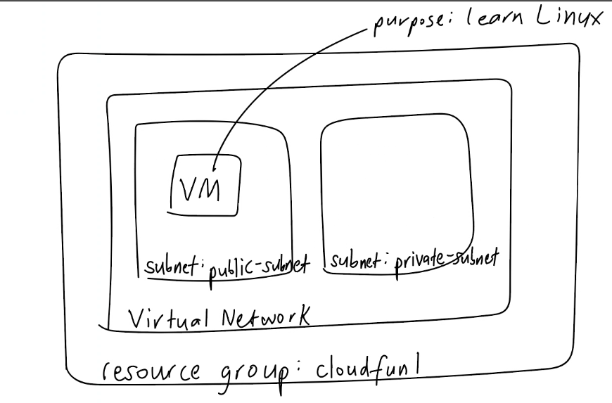

# Learn Azure



## How VM is structured on Azure

- First, you need to create a `subscription`. Everything else you create will be inside your subscription
- Everything on Azure needs to go in a `Resource Group`. This is like a container.
- Inside the `Resource Group`, we will create a `Virtual Network`. This is how we can talk to other resources.
- Inside the `Virtual Network`, you need to organise things into a room-like space thing called a `Subnet`.
- Create two subnets => `public-subnet` to run our app and `private-subnet` to run our database.
- Our VM will be linked to `SSH Public Key`. It uses `Key-Pair`. It's an RSA key.

## Generate SSH Key-Pair

```.md
cd or cd ~ => changes directory to the root directory
ls -al => make sure you have .ssh
mkdir .ssh => create it if you don't already have it.
cd .ssh
```

## To generate our ssh key-pair, run the command

`ssh-keygen -t rsa -b 4096 -C "youremailaddress"`

- That is: `ssh-keygen -t rsa -b 4096 -C "adesokanrasheed@yahoo.co.uk"`
- Enter file in which to save the key: cloudfun1-rasheed-az-key
- Enter passphrase for "cloudfun1-rasheed-az-key": Just press enter
- Enter same passphrase again: Press enter again

You get two files created:
1. `cloudfun1-rasheed-az-key` => this is the private
2. `cloudfun1-rasheed-az-key.pub` => this is the public

## To open Azure

- Go to `portal.azure.com`

## Create Virtual Network

- Search for `vnet` or `Virtual Network` and select it. 
- Click Create
